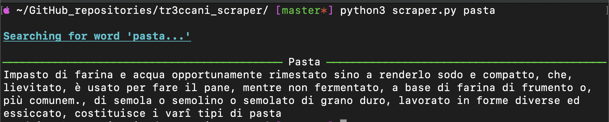

# **Tr3ccani-scraper**  


If you've you ever thought "*I wonder what the definition of 'pasta' is in Italian*", this CLI is for you!



The **Treccani Encyclopaedia** is a renowned and revered source of knowledge for any respectable italian🇮🇹.

Since they do not provide any APIs exposing their precious dictionary, I thought i could apply my limited knowledge of web-scraping and regular expressions to a good use.  

Unfortunately I don't really have time to maintain the project, but since I plan to use it as a command-line resource I will probably make it better over time.

Anyway, if you decide to use it and have suggestions, feel free to fork, add a branch and submit a pull request: I'll make my best to review it and merge.  

## _Usage:_

The package is written in Python 3.9, but I think anything above Python 3.6 is supported.

First of all, clone the repository to a local folder on your machine.

```shell
cd <your desired folder>
git clone https://github.com/fcagnola/tr3ccani-scraper.git
```

To scrape the web I used the fantastic **requests-html** package, which you'll need to install together with **rich** for good-looking console output:

```shell
pip3 install -r requirements.txt
```

Finally, to get the definition(s) of a word, type

```shell
cd <folder where you cloned the repository>
python3 scraper.py <word>
```

The utility will run and print on the command line one result per line. As of now I only managed to get the first "*use*" for each page, but I do support multiple pages (each word can have multiple different meanings -> multiple pages, and multiple uses for that meaning).

I'm working on making it available as a python package in order to be able to use it in other scripts as well as make command-line arguments for saving the output.

## Disclaimer

The goal of this utility is simply researching a few words from a very reliable source. I do not own any content of treccani.it and this script is not intended for production environments.
You can get in touch with me for any questions not covered by the [licence](https://github.com/fcagnola/tr3ccani-scraper/blob/afb27a8aba6bf47ea109f2c1be16e27c1def8288/LICENSE) which is not intended to include any material from the encyclopaedia website, but only my script.
